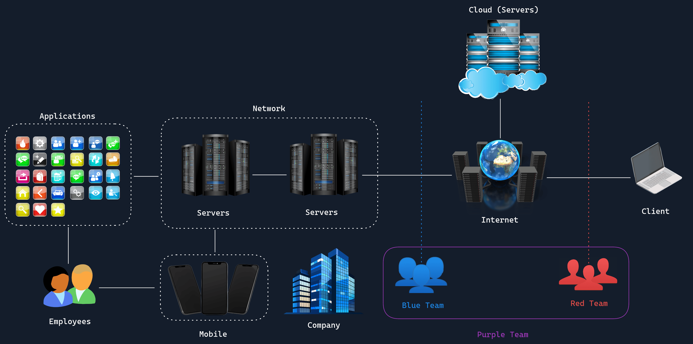

# TABLA DE CONTENIDO

1. [Introducción](#introducci%C3%B3n)
   - Structure of InfoSec (Estructura de la seguridad de la información)
   - Principles of Information Security (Principios de la Seguridad de la Información)
     
2. [InfoSec Domains (Dominios de la seguridad de la información)](#infosec-domains)
   - Network Security (Seguridad de Red)
   - Application Security (Seguridad de Aplicaciones)
   - Operational Security (Seguridad Operacional)
   - Disaster Recovery and Business Continuity (Recuperación ante Desastres y Continuidad del Negocio)
   - Cloud Security (Seguridad en la Nube)
   - Physical Security (Seguridad Física)
   - Mobile Security (Seguridad Móvil)
   - Internet of Things Security (Seguridad del Internet de las Cosas)

3. [Threats (Amenazas)](#threats)
   - Distributed Denial of Service (Denegación de Servicio Distribuida)
   - Ransomware
   - Social Engineering (Ingeniería Social)
   - Insider Threat (Amenazas Internas)
   - Advanced Persistent Threats (Amenazas Persistentes Avanzadas)
     
4. [Cybersecurity Teams](#cybersecurity-teams)
   - Threat Actors (Actores de Amenazas)
   - Red Team
   - Blue Team
   - Purple Team

5. [Job Roles (Roles de trabajo)](#job-roles)
   - Chief Information Security Officer (Director de Seguridad de la Información)
   - Penetration Testers (Pentester)
   - Security Operations Center SOC (SOC)
   - Bug Bounty Hunter (Cazador de Recompensas de Errores)

---

## Introducción
### Structure of InfoSec

La seguridad de la información (InfoSec) trata de salvaguardar la información y los sistemas de personas que no deben tener acceso a ellos.

*Client:* Es desde donde se accede a internet (Pc, portatil, movil)

*Internet:* Una inmensa red de servidores interconectados que ofrecen servicios y aplicaciones

*Servers:* Proporcionan Servicios

*Network:* Cuando varios equipos están conectados y se comunican entre si.

❗Los ataques ciberneticos pueden provocar perdidas financieras, perdida de reputación de una empresa y hasta amenazas a la seguiridad nacional.

Cual es la diferencia entre infosec y ciberseguridad?

❗CIA: Confidentiality, integrity y availability = CID: Confidencialidad, integridad y disponibilidad❗

*riesgo:* La posibilidad de que ocurra un mal evento, por ejemplo yo corro el riesgo de que en la calle me roben.

*Amenaza:* Es el actor que me puede que un riesgo se haga realidad, por ejemplo los ladrones.

*Vulnerabilidad:* Es por la debilidad donde podria una amenaza atacar, por ejemplo el ladron ve que voy solo y desarmado.

### Principles of Information Security

**1. Confidencialidad:**
- La información es accesible solo para quien esta autorizado a acceder.
- No se puede divulgar la información sin autorización.
- Se implementa cifrado y controles de acceso

**2. Integridad**
- Mantiene los datos fieles a como son (Originales, nada de 1.1 😅) durante su ciclo de vida. (Si, los datos tienen ciclo de vida)
- Este principio protege la información contra la modificación no autorizada
- Se implementa `hashing` y firmas digitales (digital signatures)

**3. Disponibilidad (Availability):**
- La imformación debe estar disponible para los usuarios autorizados cada que lo requieran.
- El acceso a la información no puede ser interrumpida
- Se implementa redundancia y se planifica su recuperación en caso de que se pierdan o pasen cositas 😣.

❗**4. No repudio (Non-repudiation):**
- Una entidad o persona no puede negar haber realizado una acción por ejemplo yo no puedo negar que firme algo, porque ahi esta la prueba, lo mismo pasa con las firmas y certificados digitales
- Se implementan firmas digitales y registros de auditoria.

**5. autenticación:**
- Verifica la identidad de un usuario, o sea se verifica que es quien dice ser.
- Se implementan contraseñas, biometría y autenticación multifactor.

**6. Privacidad**
- Es el manejo adecuado de la información personal confidencial.
- Se implementa la gestión del consentimiento.

### Procesos en Seguridad de la Información

1. Evaluación de Riesgos (Risk Assessment): Identifica y evalua posibles amenazas y vulnerabilidades.
2. Planificación de seguridad (Security Planning): Crea politicas y procedimientos para abordar los riesgos identificados y asigna los recursos para la implentación en la seguridad de la información.
3. Implemmentación de controles de seguridad: Pone en marcha los planes de seguridad e incluyen controles preventivas y de detección.
4. Monitoreo y detección: Vigila los eventos y anomalias de seguridad con herramientas SIEM y sistemas de detección de intrusos (IDS)
5. Respuesta a incidentes (Incident Response): Actua ante los incidentes de seguridad detectados siguiendo los procedimientos establecidos para mitigar las amenazas y/o contenerlas
6. Recuperación ante desastres (Disaster Recovery): Restaura sistemas y datos despues de un incidente, intenta reducir el tiempo de inactividad y la perdida de datos.
7. Mejora continua (Continuous Improvement): Se revisa y aprende de incidentes de seguridad, para actualizar o mejorar las medidas de seguridad, se hacen auditorias.

---

## InfoSec Domains
### Network Security

La seguridad de la red es como el sistema de seguridad de una casa, pero en lugar de proteger el hogar, protege una red informática de amenazas.

**Elementos:**
- Firewalls
- IDS: Detecta eventos sospechos y anomalias en la red.
- IPS: Parecido al IDS pero toma acción para bloquear posibles amenazas.
- VPN
- Mecanismos de control de acceso
- Tecnologias de encriptación: Para salvaguardar los datos en transito y en reposo haciendolo ilegibles para partes no autorizadas.

### Application Security

### Operational Security

### Disaster Recovery and Business Continuity

### Cloud Security

### Physical Security

### Mobile Security

### Internet of Things Security

---

## Threats
### Distributed Denial of Service

### Ransomware

### Social Engineering

### Insider Threat

### Advanced Persistent Threats

---

## Cybersecurity Teams
### Threat Actors

### Red Team

### Blue Team

### Purple Team

---

## Job Roles
### Chief Information Security Officer

### Penetration Testers

### Security Operations Center SOC

### Bug Bounty Hunter
