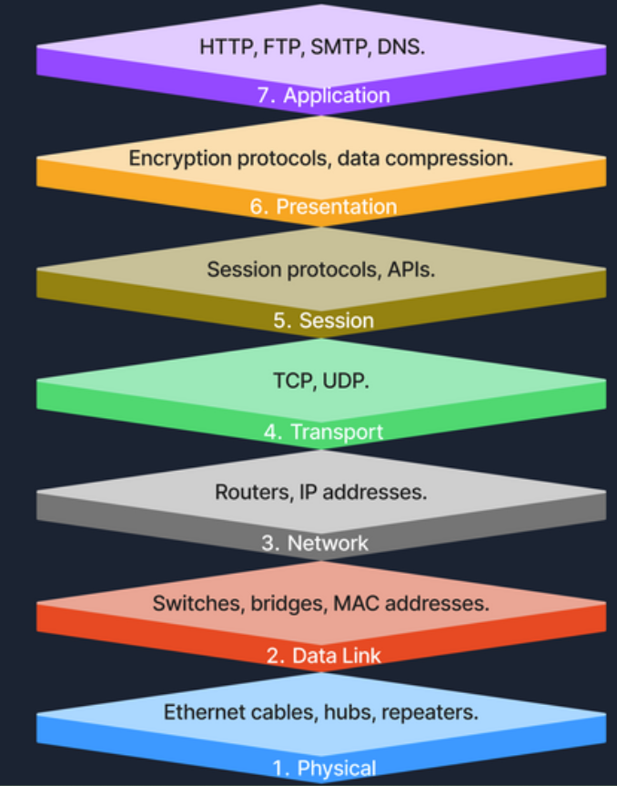
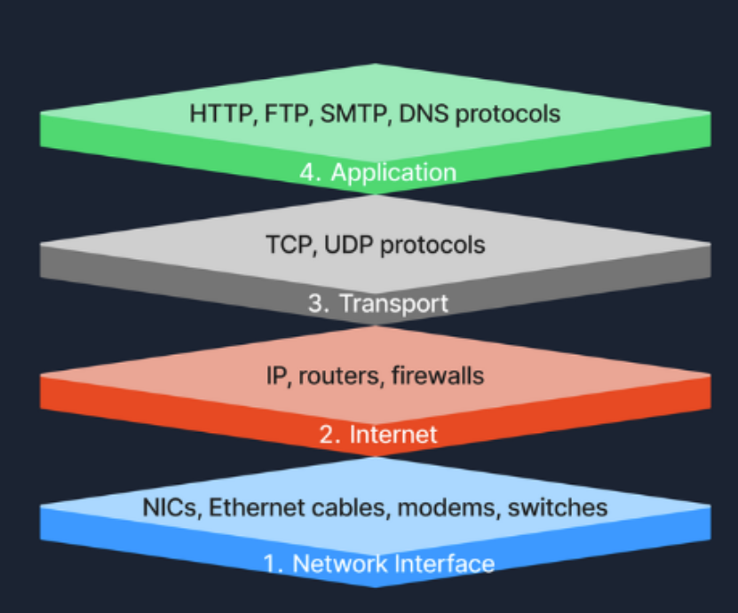

# TABLA DE CONTENIDO

1. [Fundamentos de redes](#fundamentos-de-redes)
 - Network Concepts (Conceptos de redes)
   - Modelo OSI
   - Modelo TCP/IP

2. [Network Communication and Addressing (Comunicación y Direccionamiento de red)](#network-communication-and-addressing)
- Comunicación en Red
- DHCP

---

## Fundamentos de redes
### Conceptos de redes

❗MODELO OSI (Open Systems Interconnection) ❗

- Capa 1 - Fisica: Cables ethernet, Hubs, repetidores etc.
- Capa 2 - Enlace: Switches, usan MAC address
- Capa 3 - Red: Es responsable del direccionamiento logico y determina rutas, Routers operan en esta capa, **Direcciones IP (Internet Protocol)**
- Capa 4 - Transporte: TCP (Transmission Control Protocol) y UDP (User Datagram Protocol)
     - TCP: Garantiza transmisión confiable y conexiones con recuperación de errores.
     - UDP: No se conecta con nadie, pero es mas rapido, aunque no garantiza la entrega.
- Capa 5 - Sesión: Establece, mantiene y cierra conexiones.
- Capa 6 - Presentación: Muestra los datos transferidos, esto incluye el cifrado y descifrado de datos, si se comprimen los datos o la conversión de datos (Todo para que sea legible al final)
- Capa 7 - Aplicación: Todo lo que se puede acceder atraves de una aplicación, acceder a archivos, transferirlos, modificarlos, verlos etc. **DNS, HTTP, FTP, SMTP**

🔍 EJEMPLO DE ENVIO DE UN ARCHIVO 🔍

❗Se envia un archivo ➡️ Capa de aplicación: Inicia la solicitud de transferencia del archivo ➡️ Capa de Presentación: Cifra el archivo ➡️ Capa Sesión: Inicia una sesión de comunicación con el receptor ➡️ Capa de Transporte: El archivo se segmenta para que no hayan errores en la transmisión ➡️ Capa de Red: Se determina la mejor ruta para transferir los datos del archivo ➡️ Capa de Enlace de Datos: Encapsula los datos en tramas para entregarlos nodo a nodo ➡️ Capa Fisica: Transmite los bits del archivo a traves de medio fisico, completando el proceso. ❗

❗MODELO TCP/IP ❗

❗OSI vs TCP/IP❗

💻 Modos de transmisión
- Simplex: Solo permite comunicación unidireccional, por ejemplo como de un teclado al computador.
- Half-duplex: permite comunicación bidireccional pero no simultanea, como por ejemplo los Walkie-talkies que se debe turnar para hablar.
- Full-duplex: El modo usado en llamadas telefonicas, admite comunicación bidireccional simultanea.

---

## Network Communication and Addressing
### Comunicación en Red

❗MAC: 48 bits, seis pares hexadecimales separados por dos puntos o guiones ejemplo: 00:1A:2B:3C:4D:5E, los primeros 24 bits (OUI - Organizationally Unique Identifier) son asignados al fabricante de la NIC y los 24 bits restantes son especificos del dispositivo.

❗Address Resolution Protocol (ARP) - Protocolo de resolución de direcciones: Asigna direcciones IP a direcciones MAC.

El computador "A" desea enviar datos al computador "B" ➡️ "A" utiliza el protocolo ARP para descubir la MAC de "B" asociada a su IP ➡️ "A" envia datos con la MAC de destino de "B" ➡️ El switch recibe el frame de "A" ➡️ el switch reenvia al puerto especifico donde esta conectado "B"

❗IPv4: Espacio de direcciones de 32 bits, cuatro numeros decimales separados por puntos, ejemplo: 192.168.1.1

❗IPv6: Espacio de direcciones de 128 bits, ocho grupos de cuatro digitos hexadecimales separados por dos puntos, ejemplo: 2001:0db8:85a3:0000:0000:8a2e:0370:7334

❗Puertos: Los numeros de puerto van desde 0 hasta 65535, se asignan a servicios especificos Ejemplo: http ➡️ 80, https ➡️ 443. Se dividen en categorias principales:
- Puertos conocidos (0-1023) (Well-known ports): Puertos reservados para servicios y protocolos comunes y reconocidos, estandarizados por Internet Assigned Numbers Authority (IANA)
- Puertos registrados (1024-49151) (Registered Ports): No estan tan estrictamente regulados pero la IANA los registra y asigna a servicios especificos.
- Puertos dinámicos/privados (49152-65535): Son usados por aplicaciones cliente para enviar y recibir datos de servidores, como cuando un navegador se conecta con un servidor de internet. Son dinamicos por que el SO puede seleccionarlos de manera aleatoria.

### Dynamic Host Configuration Protocol (DHCP)

❗Protocolo de Configuración Dinámica de Host DHCP

El proceso de configuración dinámica por DHCP se conoce como DORA (Discover, Offer, Request y Acknowledge)
- Discover (Descubrir): Un dispositivo que se conecta a una red transmite un **DHCP Discover** como preguntando que servidores DHCP hay disponibles.
- Offer (Ofrecer): Los servidores DHCP de la red reciben el mensajde de descubirmiento (DHCP Discover) y responden con un **Offer DHCP**, proponiendo un arrendamiento de dirección IP al cliente.
- Request (Solicitud): El cliente recibe la oferta y responde con un **DHCP Request** indicando que acepta la IP ofrecida por el servidor.
- Acknowledge (Confirmación) - ACK: El servidor DHCP envia un **DHCP Acknowledge** confirmando que se le ha asignado una IP al cliente.

---
